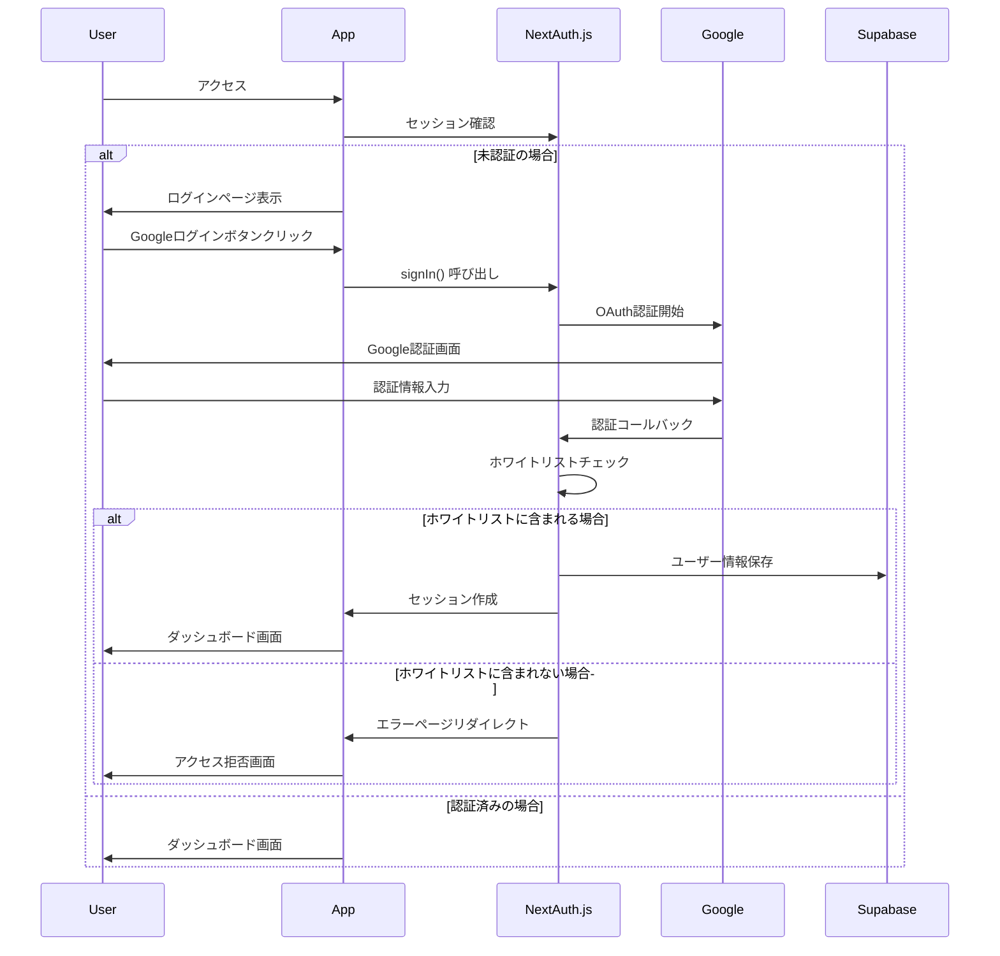

# Encore - 認証・アクセス制御設計

## 認証システム概要

### 基本方針
- **個人利用前提**: 自分専用のアプリとして設計
- **ホワイトリスト制**: 許可されたGoogleアカウントのみアクセス可能
- **シンプルな構成**: 複雑な権限管理は避け、シンプルに保つ

## NextAuth.js v5 認証

### NextAuth.js v5 設定
```typescript
// auth.ts
import NextAuth from "next-auth"
import Google from "next-auth/providers/google"
import { SupabaseAdapter } from "@auth/supabase-adapter"
import { checkWhitelist } from "@/lib/whitelist"

export const { handlers, signIn, signOut, auth } = NextAuth({
  adapter: SupabaseAdapter({
    url: process.env.SUPABASE_URL!,
    secret: process.env.SUPABASE_SERVICE_ROLE_KEY!,
  }),
  providers: [
    Google({
      clientId: process.env.GOOGLE_CLIENT_ID!,
      clientSecret: process.env.GOOGLE_CLIENT_SECRET!,
    })
  ],
  callbacks: {
    async signIn({ user, account, profile }) {
      // ホワイトリストチェック
      if (!user.email) return false
      
      const isWhitelisted = await checkWhitelist(user.email)
      if (!isWhitelisted) {
        console.log(`Access denied for email: ${user.email}`)
        return false
      }
      
      return true
    },
    async session({ session, user }) {
      // セッションにユーザー情報を追加
      if (session.user) {
        session.user.id = user.id
      }
      return session
    },
    async jwt({ token, user, account }) {
      // JWT トークンにユーザー情報を追加
      if (user) {
        token.userId = user.id
      }
      return token
    }
  },
  pages: {
    signIn: '/auth/signin',
    error: '/auth/error',
  },
  session: {
    strategy: "database",
    maxAge: 30 * 24 * 60 * 60, // 30 days
  },
  events: {
    async signIn({ user, account, profile }) {
      console.log(`User signed in: ${user.email}`)
    },
    async signOut({ session, token }) {
      console.log(`User signed out`)
    }
  }
})

// API Routes用のヘルパー
// app/api/auth/[...nextauth]/route.ts
import { handlers } from "@/auth"
export const { GET, POST } = handlers

// サーバーサイドでの認証チェック
export const getServerSession = () => auth()

// クライアントサイド用の認証フック
import { useSession } from "next-auth/react"

export function useAuth() {
  const { data: session, status } = useSession()
  
  return {
    user: session?.user,
    loading: status === "loading",
    authenticated: !!session
  }
}
```

### 認証フロー


## ホワイトリスト管理

### データベース設計
```sql
-- ホワイトリストテーブル
CREATE TABLE whitelist_emails (
  id uuid PRIMARY KEY DEFAULT gen_random_uuid(),
  email text UNIQUE NOT NULL,
  added_at timestamp with time zone DEFAULT now(),
  added_by uuid REFERENCES users(id),
  is_active boolean DEFAULT true,
  notes text
);

-- ユーザーテーブルにホワイトリストフラグ追加
ALTER TABLE users ADD COLUMN is_whitelisted boolean DEFAULT false;
```

### ホワイトリストチェック機能
```typescript
// lib/whitelist.ts
import { supabase } from './supabase'

export async function checkWhitelist(email: string): Promise<boolean> {
  try {
    const { data, error } = await supabase
      .from('whitelist_emails')
      .select('email')
      .eq('email', email.toLowerCase())
      .eq('is_active', true)
      .single()
    
    return !!data && !error
  } catch (error) {
    console.error('Whitelist check error:', error)
    return false
  }
}

export async function addToWhitelist(email: string, addedBy: string, notes?: string) {
  const { data, error } = await supabase
    .from('whitelist_emails')
    .insert({
      email: email.toLowerCase(),
      added_by: addedBy,
      notes
    })
  
  return { data, error }
}

export async function getWhitelistEmails() {
  const { data, error } = await supabase
    .from('whitelist_emails')
    .select('*')
    .eq('is_active', true)
    .order('added_at', { ascending: false })
  
  return { data, error }
}

// 初期ホワイトリストの設定（環境変数から）
export async function initializeWhitelist() {
  const initialEmails = process.env.INITIAL_WHITELIST_EMAILS?.split(',') || []
  
  for (const email of initialEmails) {
    const trimmedEmail = email.trim().toLowerCase()
    if (trimmedEmail) {
      // 既存チェック
      const { data: existing } = await supabase
        .from('whitelist_emails')
        .select('email')
        .eq('email', trimmedEmail)
        .single()
      
      if (!existing) {
        await addToWhitelist(trimmedEmail, 'system', 'Initial setup')
      }
    }
  }
}
```

## アクセス制御 (Row Level Security)

### Supabase RLS ポリシー

#### users テーブル
```sql
-- ユーザーは自分の情報のみ参照・更新可能
CREATE POLICY "Users can view own profile" ON users
  FOR SELECT USING (auth.uid() = id);

CREATE POLICY "Users can update own profile" ON users
  FOR UPDATE USING (auth.uid() = id);
```

#### bookmarks テーブル
```sql
-- ユーザーは自分のブックマークのみアクセス可能
CREATE POLICY "Users can view own bookmarks" ON bookmarks
  FOR SELECT USING (auth.uid() = user_id);

CREATE POLICY "Users can insert own bookmarks" ON bookmarks
  FOR INSERT WITH CHECK (auth.uid() = user_id);

CREATE POLICY "Users can update own bookmarks" ON bookmarks
  FOR UPDATE USING (auth.uid() = user_id);

CREATE POLICY "Users can delete own bookmarks" ON bookmarks
  FOR DELETE USING (auth.uid() = user_id);
```

#### tags テーブル
```sql
-- ユーザーは自分のタグのみアクセス可能
CREATE POLICY "Users can manage own tags" ON tags
  FOR ALL USING (auth.uid() = user_id);
```

#### bookmark_tags テーブル
```sql
-- ブックマークの所有者のみタグ操作可能
CREATE POLICY "Users can manage own bookmark tags" ON bookmark_tags
  FOR ALL USING (
    EXISTS (
      SELECT 1 FROM bookmarks 
      WHERE bookmarks.id = bookmark_tags.bookmark_id 
      AND bookmarks.user_id = auth.uid()
    )
  );
```

## ミドルウェア・認証ガード

### Next.js Middleware (NextAuth.js v5)
```typescript
// middleware.ts
import { auth } from "@/auth"
import { NextResponse } from "next/server"
import type { NextRequest } from "next/server"

export default auth((req) => {
  const { nextUrl } = req
  const session = req.auth

  // 認証が必要なルートの保護
  const protectedRoutes = ['/dashboard', '/bookmarks', '/tags', '/settings']
  const isProtectedRoute = protectedRoutes.some(route => 
    nextUrl.pathname.startsWith(route)
  )

  if (isProtectedRoute) {
    if (!session) {
      return NextResponse.redirect(new URL('/auth/signin', req.url))
    }

    // ホワイトリストは NextAuth.js の signIn callback で既にチェック済み
    // セッションが存在する = ホワイトリストを通過済み
  }

  // API ルートの保護
  if (nextUrl.pathname.startsWith('/api/') && 
      !nextUrl.pathname.startsWith('/api/auth/')) {
    if (!session) {
      return NextResponse.json(
        { error: 'Unauthorized' },
        { status: 401 }
      )
    }
  }

  return NextResponse.next()
})

export const config = {
  matcher: [
    '/dashboard/:path*',
    '/bookmarks/:path*',
    '/tags/:path*',
    '/settings/:path*',
    '/api/:path*'
  ]
}
```

### React Hook (認証状態管理) - 更新済み
```typescript
// hooks/use-auth.ts - NextAuth.js v5対応
import { useSession, signIn, signOut } from "next-auth/react"

export function useAuth() {
  const { data: session, status } = useSession()

  return {
    user: session?.user,
    userId: session?.user?.id,
    loading: status === "loading",
    authenticated: !!session,
    signIn: () => signIn('google'),
    signOut: () => signOut()
  }
}

// サーバーコンポーネント用のヘルパー
// lib/auth-server.ts
import { auth } from "@/auth"
import { redirect } from "next/navigation"

export async function requireAuth() {
  const session = await auth()
  
  if (!session) {
    redirect('/auth/signin')
  }
  
  return session
}

export async function getCurrentUser() {
  const session = await auth()
  return session?.user || null
}

// API Route用の認証チェック
// lib/auth-api.ts
import { auth } from "@/auth"
import { NextRequest } from "next/server"

export async function validateApiAuth(request: NextRequest) {
  const session = await auth()
  
  if (!session) {
    return Response.json(
      { error: 'Unauthorized' },
      { status: 401 }
    )
  }
  
  return { session, user: session.user }
}
```

## セッション管理

### NextAuth.js v5 セッション設定
```typescript
// NextAuth.js の設定 (auth.ts より抜粋)
export const { handlers, signIn, signOut, auth } = NextAuth({
  session: {
    strategy: "database", // Supabaseにセッション情報を保存
    maxAge: 30 * 24 * 60 * 60, // 30 days
    updateAge: 24 * 60 * 60, // 24 hours
  },
  // その他の設定...
})

// クライアントサイドでのセッションプロバイダー
// app/layout.tsx
import { SessionProvider } from "next-auth/react"

export default function RootLayout({
  children,
  session
}: {
  children: React.ReactNode
  session: any
}) {
  return (
    <html>
      <body>
        <SessionProvider session={session}>
          {children}
        </SessionProvider>
      </body>
    </html>
  )
}

// 環境変数設定例
// .env.local
NEXTAUTH_SECRET=your-secret-key-here
NEXTAUTH_URL=http://localhost:3000
GOOGLE_CLIENT_ID=your-google-client-id
GOOGLE_CLIENT_SECRET=your-google-client-secret
SUPABASE_URL=your-supabase-url
SUPABASE_SERVICE_ROLE_KEY=your-service-role-key
INITIAL_WHITELIST_EMAILS=your-email@gmail.com,another@gmail.com
```

### セッション有効期限・設定
- **セッション期間**: 30日（自動延長）
- **更新間隔**: 24時間毎
- **セッション保存**: Supabase Database
- **自動ログアウト**: セッション期限切れ時

## セキュリティ考慮事項

### CSRF対策
- Next.js内蔵のCSRF保護
- SameSite Cookieの利用
- Origin/Referrerヘッダーチェック

### XSS対策
- React自動エスケープ
- DOMPurifyによるサニタイゼーション
- Content Security Policy (CSP)

### その他のセキュリティ対策
```typescript
// セキュリティヘッダー設定
// next.config.ts
const nextConfig: NextConfig = {
  async headers() {
    return [
      {
        source: '/(.*)',
        headers: [
          {
            key: 'X-Frame-Options',
            value: 'DENY'
          },
          {
            key: 'X-Content-Type-Options',
            value: 'nosniff'
          },
          {
            key: 'Referrer-Policy',
            value: 'strict-origin-when-cross-origin'
          },
          {
            key: 'Content-Security-Policy',
            value: "default-src 'self'; script-src 'self' 'unsafe-eval' 'unsafe-inline'"
          }
        ]
      }
    ]
  }
}
```

## Chrome拡張機能の認証

### 拡張機能とWebアプリの連携
```typescript
// Chrome拡張機能側
// popup.js
chrome.tabs.query({active: true, currentWindow: true}, async (tabs) => {
  // NextAuth.js セッショントークンを取得
  const sessionToken = await chrome.storage.local.get(['nextauth.session-token'])
  
  const response = await fetch('https://your-app.vercel.app/api/bookmarks', {
    method: 'POST',
    headers: {
      'Content-Type': 'application/json',
      'Cookie': `next-auth.session-token=${sessionToken['nextauth.session-token']}`
    },
    body: JSON.stringify({
      url: tabs[0].url,
      title: tabs[0].title
    })
  })
})

// Web アプリ側: 拡張機能用のAPI
// app/api/extension/bookmark/route.ts
import { auth } from "@/auth"
import { NextRequest } from "next/server"

export async function POST(request: NextRequest) {
  const session = await auth()
  
  if (!session) {
    return Response.json(
      { error: 'Unauthorized' },
      { status: 401 }
    )
  }
  
  const { url, title } = await request.json()
  
  // ブックマーク保存処理
  // ...
  
  return Response.json({ success: true })
}
```

### 拡張機能認証フロー (NextAuth.js v5)
1. Web アプリでNextAuth.js経由でログイン
2. セッション情報がSupabaseに保存される
3. 拡張機能がWebアプリのCookieを共有
4. API呼び出し時にセッションCookieを使用
5. NextAuth.jsがセッションを検証

### 拡張機能の権限設定
```json
// manifest.json
{
  "host_permissions": [
    "https://your-encore-app.vercel.app/*"
  ],
  "permissions": [
    "storage",
    "cookies"
  ]
}
```