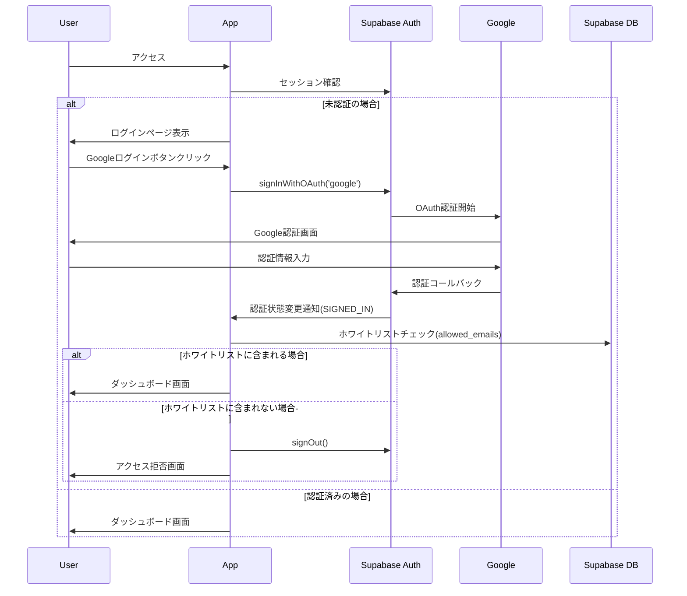

# Encore - 認証・アクセス制御設計

## 認証システム概要

### 基本方針
- **個人利用前提**: 自分専用のアプリとして設計
- **ホワイトリスト制**: 許可されたGoogleアカウントのみアクセス可能
- **シンプルな構成**: 複雑な権限管理は避け、シンプルに保つ
- **RLS活用**: SupabaseのRow Level Securityで二重の安全対策

## Supabase Auth 認証

### Supabase Auth 設定
```typescript
// lib/supabase.ts
import { createClient } from '@supabase/supabase-js'

const supabaseUrl = process.env.NEXT_PUBLIC_SUPABASE_URL!
const supabaseAnonKey = process.env.NEXT_PUBLIC_SUPABASE_ANON_KEY!

export const supabase = createClient(supabaseUrl, supabaseAnonKey)

// Google認証の実行
export const signInWithGoogle = async () => {
  const { data, error } = await supabase.auth.signInWithOAuth({
    provider: 'google',
    options: {
      redirectTo: `${window.location.origin}/auth/callback`
    }
  })
  return { data, error }
}

// サインアウト
export const signOut = async () => {
  const { error } = await supabase.auth.signOut()
  return { error }
}

// 現在のユーザー取得
export const getCurrentUser = async () => {
  const { data: { user }, error } = await supabase.auth.getUser()
  return { user, error }
}

// セッション監視
export const onAuthStateChange = (callback: (event: string, session: any) => void) => {
  return supabase.auth.onAuthStateChange(callback)
}
```

### ホワイトリストチェック機能
```typescript
// lib/auth-hooks.ts
import { supabase } from './supabase'

// サインイン後のホワイトリストチェック（Authフック）
export const setupAuthHook = () => {
  supabase.auth.onAuthStateChange(async (event, session) => {
    if (event === 'SIGNED_IN' && session?.user?.email) {
      const isAllowed = await checkWhitelistEmail(session.user.email)
      
      if (!isAllowed) {
        console.log(`Access denied for email: ${session.user.email}`)
        // 即座にサインアウト
        await supabase.auth.signOut()
        // エラーページにリダイレクト
        window.location.href = '/auth/error?message=unauthorized'
      }
    }
  })
}

// ホワイトリストメール確認（citextにより大文字小文字は自動無視）
export const checkWhitelistEmail = async (email: string): Promise<boolean> => {
  try {
    const { data, error } = await supabase
      .from('allowed_emails')
      .select('email')
      .eq('email', email) // citextにより自動で大文字小文字無視
      .single()
    
    return !!data && !error
  } catch (error) {
    console.error('Whitelist check error:', error)
    return false
  }
}

// ホワイトリストにメール追加（citextにより大文字小文字は自動無視）
export const addToWhitelist = async (email: string) => {
  const { data, error } = await supabase
    .from('allowed_emails')
    .insert({ email: email }) // citextにより自動で大文字小文字無視
  
  return { data, error }
}
```

### React用認証フック
```typescript
// hooks/use-auth.ts
import { useState, useEffect } from 'react'
import { User } from '@supabase/supabase-js'
import { supabase, signInWithGoogle, signOut as supabaseSignOut } from '@/lib/supabase'

export function useAuth() {
  const [user, setUser] = useState<User | null>(null)
  const [loading, setLoading] = useState(true)

  useEffect(() => {
    // 初回セッション確認
    const getInitialSession = async () => {
      const { data: { session } } = await supabase.auth.getSession()
      setUser(session?.user ?? null)
      setLoading(false)
    }

    getInitialSession()

    // 認証状態変更の監視
    const { data: { subscription } } = supabase.auth.onAuthStateChange(
      async (event, session) => {
        setUser(session?.user ?? null)
        setLoading(false)
      }
    )

    return () => subscription.unsubscribe()
  }, [])

  const signIn = async () => {
    const { data, error } = await signInWithGoogle()
    return { data, error }
  }

  const signOutUser = async () => {
    const { error } = await supabaseSignOut()
    return { error }
  }

  return {
    user,
    loading,
    authenticated: !!user,
    signIn,
    signOut: signOutUser
  }
}
```

### 認証フロー


## ホワイトリスト管理

### データベース設計
```sql
-- ホワイトリストテーブル（シンプル設計）
-- citextで大文字小文字を自動無視
create extension if not exists citext;

create table if not exists public.allowed_emails (
  email citext primary key
);

-- 初期ホワイトリストの設定例
insert into public.allowed_emails (email) values 
  ('your-email@gmail.com'),
  ('another-email@gmail.com')
on conflict (email) do nothing;
```

### ホワイトリスト管理機能
```typescript
// lib/whitelist.ts
import { supabase } from './supabase'

// ホワイトリストメール確認（citextにより大文字小文字は自動無視）
export async function checkWhitelistEmail(email: string): Promise<boolean> {
  try {
    const { data, error } = await supabase
      .from('allowed_emails')
      .select('email')
      .eq('email', email) // citextにより自動で大文字小文字無視
      .single()
    
    return !!data && !error
  } catch (error) {
    console.error('Whitelist check error:', error)
    return false
  }
}

// ホワイトリストにメール追加（citextにより大文字小文字は自動無視）
export async function addToWhitelist(email: string) {
  const { data, error } = await supabase
    .from('allowed_emails')
    .insert({ email: email }) // citextにより自動で大文字小文字無視
  
  return { data, error }
}

// ホワイトリスト一覧取得
export async function getWhitelistEmails() {
  const { data, error } = await supabase
    .from('allowed_emails')
    .select('*')
    .order('email')
  
  return { data, error }
}

// ホワイトリストからメール削除（citextにより大文字小文字は自動無視）
export async function removeFromWhitelist(email: string) {
  const { error } = await supabase
    .from('allowed_emails')
    .delete()
    .eq('email', email) // citextにより自動で大文字小文字無視
  
  return { error }
}
```

## アクセス制御 (Row Level Security)

### Supabase RLS ポリシー（ホワイトリスト統合）

#### bookmarks テーブル（主要例）
```sql
-- ブックマークテーブル作成
create table if not exists public.bookmarks (
  id uuid primary key default gen_random_uuid(),
  user_id uuid not null references auth.users(id) on delete cascade,
  url text not null,
  canonical_url text not null, -- 正規化済みURL（重複防止用）
  title text,
  description text,
  thumbnail_url text,
  memo text,
  is_favorite boolean default false,
  is_pinned boolean default false,
  status text check (status in ('unread','read')) default 'unread',
  created_at timestamptz default now(),
  updated_at timestamptz default now()
);

-- RLS有効化
alter table public.bookmarks enable row level security;

-- 読み取りポリシー（ホワイトリスト＆本人のみ）
create policy "read_own_if_allowed" on public.bookmarks
for select using (
  user_id = auth.uid()
  and exists (select 1 from public.allowed_emails ae
              where ae.email = (auth.jwt()->>'email'))
);

-- 書き込みポリシー（ホワイトリスト＆本人のみ）
create policy "write_own_if_allowed" on public.bookmarks
for insert with check (
  user_id = auth.uid()
  and exists (select 1 from public.allowed_emails ae
              where ae.email = (auth.jwt()->>'email'))
);

-- 更新ポリシー
create policy "update_own_if_allowed" on public.bookmarks
for update using (
  user_id = auth.uid()
  and exists (select 1 from public.allowed_emails ae
              where ae.email = (auth.jwt()->>'email'))
);

-- 削除ポリシー
create policy "delete_own_if_allowed" on public.bookmarks
for delete using (
  user_id = auth.uid()
  and exists (select 1 from public.allowed_emails ae
              where ae.email = (auth.jwt()->>'email'))
);
```

#### tags テーブル
```sql
-- タグテーブル作成
create table if not exists public.tags (
  id uuid primary key default gen_random_uuid(),
  user_id uuid not null references auth.users(id) on delete cascade,
  name text not null,
  color text default '#6366f1',
  created_at timestamptz default now(),
  unique(user_id, name)
);

alter table public.tags enable row level security;

-- タグ管理ポリシー
create policy "manage_own_tags_if_allowed" on public.tags
for all using (
  user_id = auth.uid()
  and exists (select 1 from public.allowed_emails ae
              where ae.email = (auth.jwt()->>'email'))
);
```

#### bookmark_tags テーブル
```sql
-- ブックマークタグ関連テーブル
create table if not exists public.bookmark_tags (
  id uuid primary key default gen_random_uuid(),
  bookmark_id uuid not null references public.bookmarks(id) on delete cascade,
  tag_id uuid not null references public.tags(id) on delete cascade,
  created_at timestamptz default now(),
  unique(bookmark_id, tag_id)
);

alter table public.bookmark_tags enable row level security;

-- ブックマークの所有者かつホワイトリストユーザーのみタグ操作可能
create policy "manage_bookmark_tags_if_allowed" on public.bookmark_tags
for all using (
  exists (
    select 1 from public.bookmarks b
    where b.id = bookmark_tags.bookmark_id 
    and b.user_id = auth.uid()
    and exists (select 1 from public.allowed_emails ae
                where ae.email = (auth.jwt()->>'email'))
  )
);
```

## ミドルウェア・認証ガード

### Next.js Middleware (Supabase Auth)
```typescript
// middleware.ts
import { createServerClient, type CookieOptions } from '@supabase/ssr'
import { NextResponse, type NextRequest } from 'next/server'

export async function middleware(request: NextRequest) {
  const { pathname } = request.nextUrl
  
  // 認証が必要なルートの定義
  const protectedRoutes = ['/dashboard', '/bookmarks', '/tags', '/settings']
  const isProtectedRoute = protectedRoutes.some(route => pathname.startsWith(route))
  const isApiRoute = pathname.startsWith('/api/') && !pathname.startsWith('/api/auth/')
  
  if (isProtectedRoute || isApiRoute) {
    let response = NextResponse.next({
      request: {
        headers: request.headers,
      },
    })

    const supabase = createServerClient(
      process.env.NEXT_PUBLIC_SUPABASE_URL!,
      process.env.NEXT_PUBLIC_SUPABASE_ANON_KEY!,
      {
        cookies: {
          get(name: string) {
            return request.cookies.get(name)?.value
          },
          set(name: string, value: string, options: CookieOptions) {
            request.cookies.set({ name, value, ...options })
            response = NextResponse.next({
              request: {
                headers: request.headers,
              },
            })
            response.cookies.set({ name, value, ...options })
          },
          remove(name: string, options: CookieOptions) {
            request.cookies.set({ name, value: '', ...options })
            response = NextResponse.next({
              request: {
                headers: request.headers,
              },
            })
            response.cookies.set({ name, value: '', ...options })
          },
        },
      }
    )

    const {
      data: { user },
    } = await supabase.auth.getUser()

    // 認証が必要なルートでユーザーがいない場合
    if (!user) {
      if (isApiRoute) {
        return NextResponse.json({ error: 'Unauthorized' }, { status: 401 })
      } else {
        return NextResponse.redirect(new URL('/auth/signin', request.url))
      }
    }

    // ホワイトリストチェックはクライアントサイドで実施
    // あるいはRLSポリシーでチェックされる

    return response
  }

  return NextResponse.next()
}

export const config = {
  matcher: [
    '/dashboard/:path*',
    '/bookmarks/:path*', 
    '/tags/:path*',
    '/settings/:path*',
    '/api/:path*'
  ]
}
```

### サーバーコンポーネント用認証ヘルパー
```typescript
// lib/auth-server.ts
import { createServerClient, type CookieOptions } from '@supabase/ssr'
import { cookies } from 'next/headers'
import { redirect } from 'next/navigation'

export async function createServerSupabaseClient() {
  const cookieStore = cookies()

  return createServerClient(
    process.env.NEXT_PUBLIC_SUPABASE_URL!,
    process.env.NEXT_PUBLIC_SUPABASE_ANON_KEY!,
    {
      cookies: {
        get(name: string) {
          return cookieStore.get(name)?.value
        },
        set(name: string, value: string, options: CookieOptions) {
          try {
            cookieStore.set({ name, value, ...options })
          } catch (error) {
            // サーバーコンポーネント内ではcookieを設定できない場合がある
          }
        },
        remove(name: string, options: CookieOptions) {
          try {
            cookieStore.set({ name, value: '', ...options })
          } catch (error) {
            // サーバーコンポーネント内ではcookieを削除できない場合がある
          }
        },
      },
    }
  )
}

// 認証必須のサーバーコンポーネント用
export async function requireAuth() {
  const supabase = await createServerSupabaseClient()
  const { data: { user }, error } = await supabase.auth.getUser()
  
  if (!user || error) {
    redirect('/auth/signin')
  }
  
  return { user, supabase }
}

// 現在のユーザー取得
export async function getCurrentUser() {
  const supabase = await createServerSupabaseClient()
  const { data: { user } } = await supabase.auth.getUser()
  return user
}

// API Route用の認証チェック
export async function validateApiAuth() {
  const supabase = await createServerSupabaseClient()
  const { data: { user }, error } = await supabase.auth.getUser()
  
  if (!user || error) {
    return { user: null, error: 'Unauthorized' }
  }
  
  return { user, error: null }
}
```

## セッション管理

### Supabase Auth セッション設定
```typescript
// app/layout.tsx - クライアントサイドでの認証プロバイダー
import { AuthProvider } from '@/components/auth-provider'

export default function RootLayout({
  children,
}: {
  children: React.ReactNode
}) {
  return (
    <html>
      <body>
        <AuthProvider>
          {children}
        </AuthProvider>
      </body>
    </html>
  )
}
```

```typescript
// components/auth-provider.tsx
'use client'
import { createContext, useContext, useEffect, useState } from 'react'
import { User } from '@supabase/supabase-js'
import { supabase, checkWhitelistEmail } from '@/lib/supabase'

type AuthContextType = {
  user: User | null
  loading: boolean
}

const AuthContext = createContext<AuthContextType>({
  user: null,
  loading: true
})

export function AuthProvider({ children }: { children: React.ReactNode }) {
  const [user, setUser] = useState<User | null>(null)
  const [loading, setLoading] = useState(true)

  useEffect(() => {
    // 初回セッション取得
    const getInitialSession = async () => {
      const { data: { session } } = await supabase.auth.getSession()
      setUser(session?.user ?? null)
      setLoading(false)
    }

    getInitialSession()

    // 認証状態変更の監視＆ホワイトリストチェック
    const { data: { subscription } } = supabase.auth.onAuthStateChange(
      async (event, session) => {
        if (event === 'SIGNED_IN' && session?.user?.email) {
          const isAllowed = await checkWhitelistEmail(session.user.email)
          
          if (!isAllowed) {
            console.log(`Access denied for email: ${session.user.email}`)
            await supabase.auth.signOut()
            window.location.href = '/auth/error?message=unauthorized'
            return
          }
        }
        
        setUser(session?.user ?? null)
        setLoading(false)
      }
    )

    return () => subscription.unsubscribe()
  }, [])

  return (
    <AuthContext.Provider value={{ user, loading }}>
      {children}
    </AuthContext.Provider>
  )
}

export const useAuth = () => {
  const context = useContext(AuthContext)
  if (context === undefined) {
    throw new Error('useAuth must be used within an AuthProvider')
  }
  return context
}
```

### 環境変数設定
```bash
# .env.local
# Supabase設定
NEXT_PUBLIC_SUPABASE_URL=your-supabase-url
NEXT_PUBLIC_SUPABASE_ANON_KEY=your-supabase-anon-key

# Google OAuth設定（Supabaseダッシュボードで設定）
# GOOGLE_CLIENT_IDとGOOGLE_CLIENT_SECRETはSupabaseダッシュボードで設定
```

### セッション有効期限・設定
- **セッション期間**: Supabaseのデフォルト設定（アクセストークン: 1時間、リフレッシュトークン: 24時間）
- **自動リフトレッシュ**: Supabaseが自動でトークン更新
- **セッション保存**: ブラウザのHTTPOnly Cookie
- **自動ログアウト**: リフレッシュトークン期限切れ時

## セキュリティ考慮事項

### CSRF対策
- Next.js内蔵のCSRF保護
- SameSite Cookieの利用
- Origin/Referrerヘッダーチェック

### XSS対策
- React自動エスケープ
- DOMPurifyによるサニタイゼーション
- Content Security Policy (CSP)

### その他のセキュリティ対策
```typescript
// セキュリティヘッダー設定
// next.config.ts
const nextConfig: NextConfig = {
  async headers() {
    return [
      {
        source: '/(.*)',
        headers: [
          {
            key: 'X-Frame-Options',
            value: 'DENY'
          },
          {
            key: 'X-Content-Type-Options',
            value: 'nosniff'
          },
          {
            key: 'Referrer-Policy',
            value: 'strict-origin-when-cross-origin'
          },
          {
            key: 'Content-Security-Policy',
            value: "default-src 'self'; script-src 'self' 'unsafe-eval' 'unsafe-inline'; connect-src 'self' https://*.supabase.co"
          }
        ]
      }
    ]
  }
}
```

### クライアントサイドでのデータ操作例
```typescript
// データベース操作の例
import { supabase } from '@/lib/supabase'

// ブックマーク作成（RLSポリシーで自動的にホワイトリスト＆所有者チェック）
export async function createBookmark(url: string, title: string) {
  const { data: { user } } = await supabase.auth.getUser()
  
  if (!user) {
    throw new Error('User not authenticated')
  }
  
  const { data, error } = await supabase
    .from('bookmarks')
    .insert({
      user_id: user.id,
      url,
      title
    })
    .select()
    .single()
  
  if (error) {
    // RLSポリシーでブロックされた場合もここでエラーになる
    throw new Error(error.message)
  }
  
  return data
}

// ブックマーク一覧取得（RLSポリシーで自動フィルタ）
export async function getBookmarks() {
  const { data, error } = await supabase
    .from('bookmarks')
    .select('*')
    .order('created_at', { ascending: false })
  
  if (error) {
    throw new Error(error.message)
  }
  
  return data
}
```

## Chrome拡張機能の認証

### 拡張機能とWebアプリの連携
```typescript
// Chrome拡張機能側 - popup.js
chrome.tabs.query({active: true, currentWindow: true}, async (tabs) => {
  try {
    // Supabaseセッショントークンを取得
    const cookies = await chrome.cookies.getAll({
      domain: 'your-encore-app.vercel.app'
    })
    
    const authCookies = cookies.filter(cookie => 
      cookie.name.startsWith('sb-') // Supabaseのcookieプレフィックス
    )
    
    const cookieHeader = authCookies
      .map(cookie => `${cookie.name}=${cookie.value}`)
      .join('; ')
    
    const response = await fetch('https://your-encore-app.vercel.app/api/bookmarks', {
      method: 'POST',
      headers: {
        'Content-Type': 'application/json',
        'Cookie': cookieHeader
      },
      body: JSON.stringify({
        url: tabs[0].url,
        title: tabs[0].title
      })
    })
    
    if (response.ok) {
      // 保存成功の通知
      chrome.action.setBadgeText({ text: '✓' })
      setTimeout(() => {
        chrome.action.setBadgeText({ text: '' })
      }, 2000)
    }
  } catch (error) {
    console.error('Bookmark save failed:', error)
    chrome.action.setBadgeText({ text: '!' })
  }
})
```

```typescript
// Webアプリ側: 拡張機能用API
// app/api/bookmarks/route.ts
import { createServerSupabaseClient } from '@/lib/auth-server'
import { NextRequest } from 'next/server'

export async function POST(request: NextRequest) {
  const supabase = await createServerSupabaseClient()
  const { data: { user }, error } = await supabase.auth.getUser()
  
  if (!user || error) {
    return Response.json({ error: 'Unauthorized' }, { status: 401 })
  }
  
  const { url, title } = await request.json()
  
  // ホワイトリストチェックはRLSポリシーで自動でチェックされる
  const { data, error: insertError } = await supabase
    .from('bookmarks')
    .insert({
      user_id: user.id,
      url,
      title
    })
    .select()
    .single()
  
  if (insertError) {
    return Response.json({ error: insertError.message }, { status: 400 })
  }
  
  return Response.json({ success: true, data })
}
```

### 拡張機能認証フロー (Supabase Auth)
1. WebアプリでSupabase Auth経由でGoogleログイン
2. SupabaseがHTTPOnly Cookieでセッション管理
3. Chrome拡張機能がドメインのCookieを取得
4. API呼び出し時にCookieヘッダーで送信
5. Supabaseがセッションを検証＆RLSポリシーでアクセス制御

### 拡張機能の権限設定
```json
// manifest.json
{
  "manifest_version": 3,
  "name": "Encore - Read Later",
  "version": "1.0.0",
  "host_permissions": [
    "https://your-encore-app.vercel.app/*"
  ],
  "permissions": [
    "activeTab",
    "cookies"
  ],
  "background": {
    "service_worker": "background.js"
  },
  "action": {
    "default_popup": "popup.html"
  }
}
```