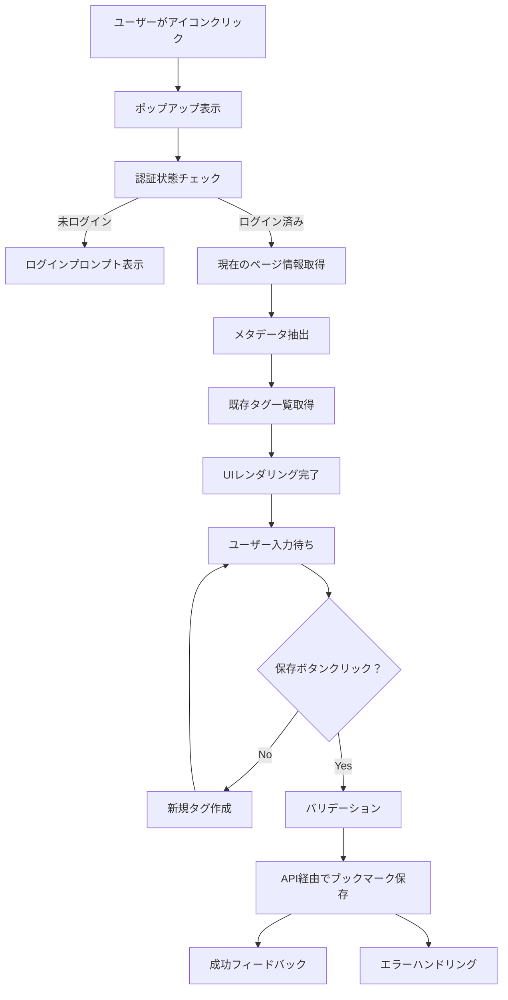

# Chrome拡張機能設計書

## 📋 概要

**名称**: Encore Bookmark Extension  
**バージョン**: 1.0.0  
**目的**: 現在開いているWebページを、既存のEncoreブックマーク管理システムに素早く保存  
**対象ユーザー**: Encoreブックマーク管理システムの利用者  
**開発言語**: JavaScript (Vanilla)  
**対象ブラウザ**: Google Chrome (Manifest V3)

## 🎯 主要機能

### 1. ワンクリックブックマーク保存
- 拡張機能アイコンクリックで現在のページを即座に保存
- タイトル、URL、description、サムネイルの自動取得
- メタデータの自動抽出（OGタグ、Twitterカード等）

### 2. タグ管理機能
- **既存タグ選択**: サーバーから取得したタグ一覧からの選択（複数選択可能）
- **新規タグ作成**: インライン新規タグ作成機能
- **タグの色分け表示**: 既存システムの色設定を踏襲
- **タグ検索**: タグ数が多い場合のフィルタリング機能

### 3. 認証・連携機能
- Supabase認証システムとの完全連携
- ログイン状態の自動判定
- セッション管理とトークン更新
- 既存Webアプリケーションとのシームレスな連携

### 4. ユーザビリティ機能
- 保存状況のリアルタイム表示
- エラーハンドリングと適切なフィードバック
- オフライン時の対応（キューイング機能）
- ショートカットキー対応（Ctrl+Shift+B等）

## 🏗️ システムアーキテクチャ

### ファイル構成
```
chrome-extension/
├── manifest.json                 # 拡張機能メタデータ
├── popup/
│   ├── popup.html               # メインポップアップUI
│   ├── popup.js                 # ポップアップ制御ロジック
│   ├── popup.css                # UI スタイル定義
│   └── components/
│       ├── tag-selector.js      # タグ選択コンポーネント
│       ├── bookmark-form.js     # ブックマーク入力フォーム
│       └── login-form.js        # ログインフォーム
├── background/
│   └── service-worker.js        # バックグラウンド処理
├── content-scripts/
│   ├── content.js               # ページ情報収集
│   └── metadata-extractor.js   # メタデータ抽出ロジック
├── shared/
│   ├── api.js                   # Encore APIとの通信
│   ├── auth.js                  # 認証処理
│   ├── storage.js               # ローカルストレージ管理
│   └── utils.js                 # 共通ユーティリティ
├── assets/
│   ├── icons/
│   │   ├── icon-16.png          # 16x16 アイコン
│   │   ├── icon-48.png          # 48x48 アイコン
│   │   └── icon-128.png         # 128x128 アイコン
│   └── images/
│       ├── logo.png
│       └── default-thumbnail.png
└── locales/                     # 多言語対応（将来的）
    ├── en/
    └── ja/
```

### 技術スタック

#### フロントエンド
- **JavaScript**: Vanilla JavaScript (ES6+)
- **CSS**: Modern CSS（Grid, Flexbox, CSS Variables）
- **HTML**: Semantic HTML5

#### API・認証
- **REST API**: 既存EncoreシステムのAPIエンドポイント
- **認証**: Supabase Auth (JWT Token)
- **通信**: Fetch API with error handling

#### ストレージ
- **Chrome Storage API**: 設定・キャッシュデータ
- **Session Storage**: 一時的なUI状態
- **IndexedDB**: オフライン時のキュー管理

## 🔧 詳細設計

### 1. Manifest.json設計
```json
{
  "manifest_version": 3,
  "name": "Encore Bookmark Extension",
  "version": "1.0.0",
  "description": "Save bookmarks to your Encore collection with tags",
  "author": "Encore Team",
  
  "permissions": [
    "activeTab",
    "storage",
    "scripting"
  ],
  
  "host_permissions": [
    "https://*.encore-domain.com/*"
  ],
  
  "action": {
    "default_popup": "popup/popup.html",
    "default_title": "Save to Encore",
    "default_icon": {
      "16": "assets/icons/icon-16.png",
      "48": "assets/icons/icon-48.png",
      "128": "assets/icons/icon-128.png"
    }
  },
  
  "background": {
    "service_worker": "background/service-worker.js",
    "type": "module"
  },
  
  "content_scripts": [
    {
      "matches": ["<all_urls>"],
      "js": ["content-scripts/content.js"],
      "run_at": "document_idle"
    }
  ],
  
  "commands": {
    "save-bookmark": {
      "suggested_key": {
        "default": "Ctrl+Shift+B"
      },
      "description": "Save current page to Encore"
    }
  },
  
  "web_accessible_resources": [
    {
      "resources": ["assets/images/*"],
      "matches": ["<all_urls>"]
    }
  ]
}
```

### 2. ポップアップUI設計

#### レイアウト構成
```
┌─────────────────────────────────┐
│ 🔖 Encore Bookmark             │
├─────────────────────────────────┤
│ [サムネイル] │ タイトル          │
│            │ URL (短縮表示)     │
├─────────────────────────────────┤
│ メモ (オプション):               │
│ [テキストエリア]                 │
├─────────────────────────────────┤
│ タグ:                          │
│ [🏷️ React] [🏷️ Design] [+ 新規] │
│ [検索ボックス] (タグが多い場合)   │
├─────────────────────────────────┤
│ [💾 ブックマークを保存]         │
│ [ログインが必要です] (未ログイン) │
└─────────────────────────────────┘
```

#### 状態管理
```javascript
// UI状態の定義
const PopupState = {
  LOADING: 'loading',           // 初期化中
  LOGIN_REQUIRED: 'login',      // ログイン必要
  READY: 'ready',              // 保存準備完了
  SAVING: 'saving',            // 保存処理中
  SUCCESS: 'success',          // 保存完了
  ERROR: 'error'               // エラー発生
}
```

### 3. API連携設計

#### エンドポイント定義
```javascript
const API_ENDPOINTS = {
  // 認証関連
  AUTH_USER: '/api/auth/user',
  AUTH_LOGIN: '/api/auth/login',
  AUTH_LOGOUT: '/api/auth/logout',
  
  // ブックマーク関連
  BOOKMARKS: '/api/bookmarks',
  BOOKMARK_CREATE: '/api/bookmarks',
  BOOKMARK_UPDATE: '/api/bookmarks/:id',
  BOOKMARK_DELETE: '/api/bookmarks/:id',
  
  // タグ関連
  TAGS: '/api/tags',
  TAG_CREATE: '/api/tags',
  TAG_UPDATE: '/api/tags/:id',
  TAG_DELETE: '/api/tags/:id',
  
  // メタデータ抽出
  METADATA_EXTRACT: '/api/metadata/extract'
}
```

#### データモデル
```typescript
interface BookmarkCreateRequest {
  url: string
  title?: string
  description?: string
  memo?: string
  tagIds?: string[]
  thumbnailUrl?: string
}

interface TagCreateRequest {
  name: string
  color: string
}

interface ExtensionConfig {
  autoSave: boolean
  defaultTags: string[]
  shortcutEnabled: boolean
}
```

### 4. データフロー設計



## 🎨 UI/UX設計

### デザインシステム

#### カラーパレット
```css
:root {
  /* Primary Colors */
  --primary-50: #eff6ff;
  --primary-500: #3b82f6;
  --primary-600: #2563eb;
  --primary-700: #1d4ed8;
  
  /* Semantic Colors */
  --success: #10b981;
  --warning: #f59e0b;
  --error: #ef4444;
  --info: #06b6d4;
  
  /* Neutral Colors */
  --gray-50: #f9fafb;
  --gray-100: #f3f4f6;
  --gray-500: #6b7280;
  --gray-900: #111827;
  
  /* Spacing */
  --space-1: 0.25rem;
  --space-2: 0.5rem;
  --space-3: 0.75rem;
  --space-4: 1rem;
  --space-6: 1.5rem;
  
  /* Typography */
  --font-sm: 0.875rem;
  --font-base: 1rem;
  --font-lg: 1.125rem;
}
```

#### コンポーネント設計
```css
/* ボタンコンポーネント */
.btn {
  padding: var(--space-2) var(--space-4);
  border-radius: 0.375rem;
  font-size: var(--font-sm);
  font-weight: 500;
  transition: all 0.2s ease;
  cursor: pointer;
  border: none;
}

.btn-primary {
  background: var(--primary-600);
  color: white;
}

.btn-primary:hover {
  background: var(--primary-700);
}

/* タグコンポーネント */
.tag {
  display: inline-flex;
  align-items: center;
  padding: var(--space-1) var(--space-2);
  background: var(--gray-100);
  border-radius: 9999px;
  font-size: 0.75rem;
  gap: var(--space-1);
}

.tag-selected {
  background: var(--primary-100);
  color: var(--primary-700);
}
```

### レスポンシブ対応
```css
/* ポップアップサイズ制約 */
.popup-container {
  width: 380px;
  max-height: 600px;
  min-height: 300px;
  overflow-y: auto;
}

@media (max-width: 400px) {
  .popup-container {
    width: 320px;
  }
}
```

## 🔐 セキュリティ設計

### 認証・認可
- **JWT Token管理**: 安全なトークン保存と自動更新
- **HTTPS通信**: 全API通信の暗号化必須
- **CORS設定**: 拡張機能からのアクセス許可設定
- **CSP対応**: Content Security Policy準拠

### データ保護
- **最小権限原則**: 必要最小限のpermission要求
- **データ暗号化**: 機密データのローカル暗号化
- **セキュアストレージ**: Chrome Storage APIの適切な利用
- **入力サニタイゼーション**: XSS攻撃防止

### プライバシー配慮
```javascript
// プライバシー設定
const PRIVACY_CONFIG = {
  collectAnalytics: false,      // 使用統計収集無効
  shareData: false,            // データ共有無効
  trackingProtection: true,    // トラッキング保護有効
  encryptSensitiveData: true   // 機密データ暗号化
}
```

## 📊 パフォーマンス設計

### 最適化戦略
- **軽量化**: バンドルサイズ最小化（< 500KB）
- **遅延読み込み**: 必要時のみ機能読み込み
- **キャッシュ戦略**: タグ情報の適切なキャッシュ
- **非同期処理**: UI blocking回避

### リソース管理
```javascript
// リソース管理設定
const PERFORMANCE_CONFIG = {
  cacheExpiry: 5 * 60 * 1000,    // 5分キャッシュ
  maxCacheSize: 100,             // 最大100件キャッシュ
  requestTimeout: 10000,         // 10秒タイムアウト
  retryAttempts: 3,              // 3回リトライ
  debounceDelay: 300             // 300ms デバウンス
}
```

## 🚀 開発・デプロイ計画

### 開発フェーズ

#### Phase 1: 基本機能 (MVP)
- [ ] 基本的なブックマーク保存機能
- [ ] 認証連携
- [ ] シンプルなUI
- [ ] エラーハンドリング

#### Phase 2: タグ機能
- [ ] 既存タグ選択機能
- [ ] 新規タグ作成機能
- [ ] タグ検索・フィルタリング
- [ ] UI/UX改善

#### Phase 3: 高度な機能
- [ ] ショートカットキー対応
- [ ] オフライン対応
- [ ] バルク操作
- [ ] 設定画面

#### Phase 4: 最適化・拡張
- [ ] パフォーマンス最適化
- [ ] 多言語対応
- [ ] アクセシビリティ改善
- [ ] 分析機能

### ビルド・デプロイ設定
```javascript
// package.json scripts
{
  "scripts": {
    "dev": "webpack --mode development --watch",
    "build": "webpack --mode production",
    "test": "jest",
    "lint": "eslint src/**/*.js",
    "package": "npm run build && zip -r extension.zip dist/",
    "release": "npm run test && npm run lint && npm run package"
  }
}
```

### Chrome Web Store公開準備
- [ ] アイコン・スクリーンショット準備
- [ ] アプリ説明文作成
- [ ] プライバシーポリシー作成
- [ ] 利用規約作成
- [ ] デベロッパーアカウント設定

## 🧪 テスト計画

### 単体テスト
```javascript
// Jest設定例
describe('Bookmark API', () => {
  test('should create bookmark successfully', async () => {
    const bookmark = {
      url: 'https://example.com',
      title: 'Test Page',
      tagIds: ['tag1', 'tag2']
    }
    
    const result = await api.createBookmark(bookmark)
    expect(result.success).toBe(true)
    expect(result.data.id).toBeDefined()
  })
})
```

### 統合テスト
- [ ] ポップアップ→API→データベース連携
- [ ] 認証フロー完全テスト
- [ ] エラーシナリオテスト
- [ ] ネットワーク障害テスト

### ユーザビリティテスト
- [ ] 新規ユーザーの使いやすさ
- [ ] 既存ユーザーのワークフロー
- [ ] 異なるWebサイトでの動作
- [ ] パフォーマンステスト

### ブラウザ互換性テスト
- [ ] Chrome最新版
- [ ] Chrome安定版
- [ ] 異なるOS環境
- [ ] 異なる画面解像度

## 🔧 設定・カスタマイゼーション

### ユーザー設定
```javascript
// デフォルト設定
const DEFAULT_SETTINGS = {
  autoSave: false,              // 自動保存無効
  showNotifications: true,      // 通知表示有効
  defaultTags: [],              // デフォルトタグなし
  shortcutEnabled: true,        // ショートカット有効
  theme: 'light',               // ライトテーマ
  language: 'ja'                // 日本語
}
```

### 開発者設定
```javascript
// 開発・デバッグ設定
const DEV_CONFIG = {
  enableDebugMode: false,       // デバッグモード
  apiBaseUrl: process.env.API_BASE_URL,
  logLevel: 'info',             // ログレベル
  enableMockData: false,        // モックデータ使用
  bypassAuth: false             // 認証バイパス（開発時のみ）
}
```

## 📈 監視・分析

### エラー監視
- Sentryまたは同等のサービスでエラートラッキング
- ユーザー行動分析（プライバシー配慮）
- パフォーマンスメトリクス収集

### 成功指標 (KPI)
- 拡張機能インストール数
- 日次アクティブユーザー数
- ブックマーク保存成功率
- ユーザー満足度スコア

## 🗺️ 将来的な拡張計画

### 機能拡張
- [ ] ブックマークの一括編集
- [ ] フォルダ機能との連携
- [ ] 他ブックマークサービスからの移行
- [ ] ソーシャル共有機能

### プラットフォーム拡張
- [ ] Firefox拡張機能対応
- [ ] Safari拡張機能対応
- [ ] モバイルアプリとの連携

### API拡張
- [ ] GraphQL対応
- [ ] リアルタイム同期
- [ ] オフライン同期
- [ ] 冗長化・高可用性対応

---

この設計書は、Encoreブックマーク管理システムとシームレスに連携するChrome拡張機能の包括的な設計指針を提供します。段階的な開発アプローチにより、MVPから高度な機能まで計画的に実装していきます。